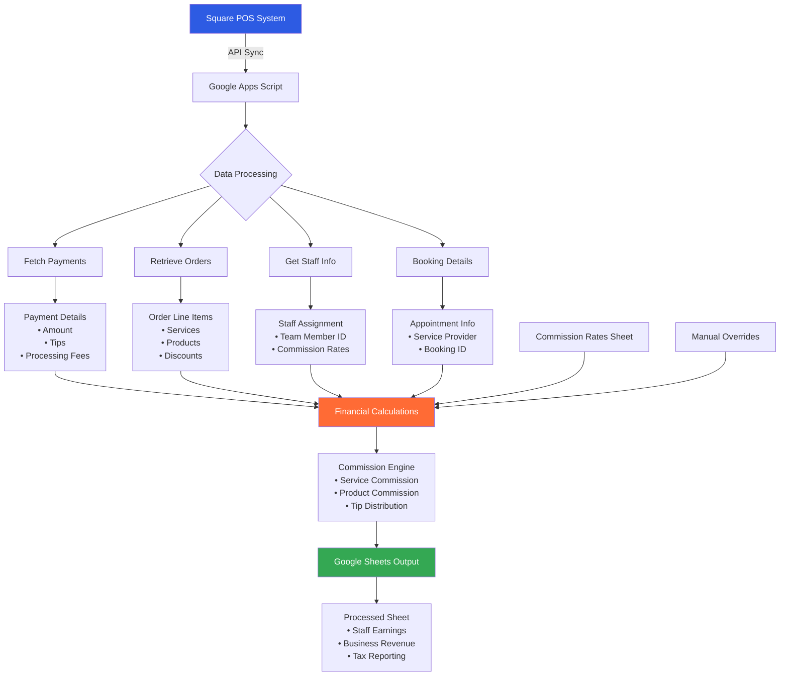

# Barbershop Transactions Automation

## Overview

This Google Apps Script system automates payroll processing for Kinship Barbershop by syncing Square POS transactions directly to Google Sheets for commission calculations, tip distribution, and financial reporting. The system evolved from a manual Wix-based process to a fully automated Square API integration.

## Business Evolution

**Phase 1 - Early Days (Wix Era)**: When Kinship Barbershop first opened, they used Wix for basic appointment booking and payment processing. As the business grew, manual payroll calculations became time-consuming and error-prone.

**Phase 2 - Current System (Square Integration)**: Business needs evolved, requiring a more robust POS system. The shop migrated to Square for its comprehensive appointment booking, payment processing, and inventory management. This transition necessitated rebuilding the entire payroll ETL pipeline using Square's API to maintain automated commission calculations and staff compensation transparency.

## Problem Solved

Service businesses often struggle with:
- **Manual Commission Calculations**: Tedious and error-prone manual calculation of staff commissions based on varying rates for services vs. products
- **Complex Payment Processing**: Difficulty separating tips, service fees, product sales, and processing costs from mixed payment data
- **Data Consistency**: Maintaining accurate records when dealing with refunds, voids, and duplicate transactions
- **Financial Transparency**: Providing clear breakdowns of earnings for staff and net revenue for the business

## System Architecture

### Square API ETL Pipeline

### Data Sources
The system integrates with three main data sources:
1. **Square Payments API**: Real-time transaction data with payment details, tips, and processing fees
2. **Square Orders API**: Line item details for services and products purchased
3. **Square Team Members API**: Staff information and booking assignments
4. **Commission Rates Sheet**: Staff-specific commission percentages configured in Google Sheets

## UpdatedProcess.js - Square API Implementation

The `UpdatedProcess.js` file contains the complete Square API integration that replaced the original Wix-based system. Key improvements include:

### 🔗 Direct API Integration
- **Real-time Sync**: Automatically fetches updated payments from Square using cursor-based pagination
- **Incremental Updates**: Only processes new or modified transactions since the last sync
- **Smart Caching**: Utilizes Google Apps Script Properties for efficient data caching (team members, customers, bookings)

### 🎯 Enhanced Staff Attribution
- **Multi-source Staff Resolution**: Prioritizes booking assignments, then payment team member, then legacy order fields
- **Team Member ID Mapping**: Links Square team member IDs to commission rates sheet for accurate payroll
- **Diagnostic Logging**: Comprehensive logging for troubleshooting staff assignment issues

### 💼 Advanced Business Logic
- **Commission Rate Hierarchy**: Item-specific overrides → Staff rates → System defaults
- **Product Type Detection**: Automatically distinguishes between services (`APPOINTMENTS_SERVICE`) and retail products
- **Smart Financial Calculations**: Handles tips, discounts, taxes, and processing fees with precision

### 📊 Robust Data Processing
- **Batch Operations**: Processes multiple API calls efficiently to stay within rate limits
- **Error Handling**: Graceful degradation with comprehensive error logging
- **Data Validation**: Prevents duplicate processing and handles edge cases

## Key Features

### 🔄 Intelligent Data Processing
- **Duplicate Prevention**: Automatically detects and skips already-processed transactions using Payment ID tracking
- **Error Handling**: Robust validation for missing sheets, malformed data, and edge cases
- **Data Cleaning**: Removes header rows and standardizes data formats

### 💰 Advanced Financial Calculations

#### Commission System
- **Service Commissions**: Calculated based on individual staff rates and service pricing
- **Product Commissions**: Separate rates for retail sales with special handling for business owners
- **Processing Fee Distribution**: Splits payment processing costs between staff and business

#### Smart Parsing
- **Service Recognition**: Extracts service type and staff assignments from combined text fields using regex patterns
- **Product Identification**: Automatically identifies and quantifies product sales from order descriptions
- **Tip Calculation**: Derives tip amounts through financial reconciliation (Amount Paid - Services - Products - Taxes)

### 📊 Comprehensive Reporting

The processed output includes 23 detailed columns:
- **Transaction Details**: Payment ID, date, customer information
- **Service Breakdown**: Service type, staff member, commission rates and amounts
- **Product Analysis**: Product names, quantities, sales amounts, and commissions
- **Financial Summary**: Tips, taxes, discounts, processing fees
- **Business Metrics**: Total staff compensation and net business revenue

### 🎨 Visual Organization
- **Color-coded columns** for different data categories (fees, services, products, adjustments)
- **Automatic formatting** with currency and percentage displays
- **Chronological sorting** for easy data analysis

## Technical Highlights

### Performance Optimization
- **Batch Processing**: Processes multiple transactions in single operations
- **Memory Efficient**: Uses Sets for duplicate detection and Maps for lookup operations
- **Minimal API Calls**: Reduces Google Sheets API usage through range-based operations

### Error Prevention
- **Transaction Deduplication**: Prevents processing the same payment multiple times
- **Status Handling**: Properly zeroes out financial data for refunded/voided transactions
- **Data Validation**: Checks for required fields and handles missing data gracefully

### Business Logic
- **Flexible Commission Structure**: Supports different rates for services vs. products
- **Owner/Manager Rules**: Special handling for business owners with different commission structures
- **Multi-Product Orders**: Intelligently distributes quantities across multiple products in single orders

## Data Processing Logic

### Input Processing
1. **Raw Data Extraction**: Reads payment processor exports with complex multi-column layouts
2. **Field Mapping**: Maps 50+ columns from raw data to relevant business fields
3. **Name Parsing**: Uses regex to extract staff assignments from "Service w/ Staff Name" format

### Financial Calculations
1. **Service Revenue**: `Service Price × Staff Commission Rate = Service Commission`
2. **Product Revenue**: `Product Price × Quantity × Product Commission Rate = Product Commission`
3. **Tip Calculation**: `Amount Paid + Discounts - Services - Products - Tax = Tips`
4. **Net Business**: `Amount Paid - Total Staff Commission - Business Processing Fee - Tax`

### Quality Assurance
- **Duplicate Detection**: Maintains Set of processed Payment IDs
- **Data Integrity**: Validates calculations and handles edge cases
- **Audit Trail**: Comprehensive logging for troubleshooting

## Business Impact

### For Staff
- **Transparent Earnings**: Clear breakdown of service commissions, product commissions, and tips
- **Accurate Payments**: Eliminates manual calculation errors
- **Fair Processing**: Equitable distribution of payment processing costs

### For Business
- **Financial Clarity**: Precise tracking of net revenue after all expenses
- **Operational Efficiency**: Reduces administrative time from hours to minutes
- **Data-Driven Decisions**: Comprehensive reporting enables business analytics

### For Customers
- **Service Quality**: Staff can focus on service rather than payment calculations
- **Transparency**: Clear itemization of services and products

## Technical Stack

- **Platform**: Google Apps Script (JavaScript runtime)
- **Data Storage**: Google Sheets with real-time formatting
- **APIs**: Square Connect API v2 (2025-07-16)
- **Key Technologies**:
  - **Square APIs**: Payments, Orders, Team Members, Customers, Bookings, Catalog
  - **Caching Strategy**: Google Apps Script Properties for API response caching
  - **Batch Processing**: Efficient bulk operations for API rate limit compliance
  - **Cursor-based Pagination**: Incremental sync for large transaction volumes
  - **Set/Map data structures** for performance optimization
  - **Comprehensive error handling** and diagnostic logging

### Square API Integration Details
- **Authentication**: Bearer token authentication with Square-Version headers
- **Rate Limiting**: Built-in delays and batch processing to respect Square's limits
- **Data Mapping**: Complex object relationship mapping between payments, orders, and staff
- **Incremental Sync**: Timestamp-based cursor tracking for efficient updates

## Usage

### Automated Sync
The system runs automatically via time-based triggers, requiring minimal user intervention. The main function `syncSquareToSheet()` handles the entire workflow:

1. **Incremental Fetch**: Retrieves only new/updated payments since last sync
2. **Data Processing**: Enriches payment data with order details, staff info, and customer data
3. **Commission Calculation**: Applies business rules for fair staff compensation
4. **Sheet Update**: Updates existing records and appends new transactions
5. **Formatting**: Applies color-coding and formatting for easy reading

### Setup Requirements
1. **Square Access Token**: Store in Google Apps Script Properties as `SQUARE_ACCESS_TOKEN`
2. **Commission Rates Sheet**: Configure staff commission percentages and Square Team Member IDs
3. **Triggers**: Set up hourly triggers for automatic sync using `createHourlyTrigger()`

### Manual Operations
- **Force Refresh**: Use `forceRefresh()` to clear caches and re-process last 30 days
- **Verify Setup**: Run `verifyCommissionRatesSetup()` to validate configuration

---
